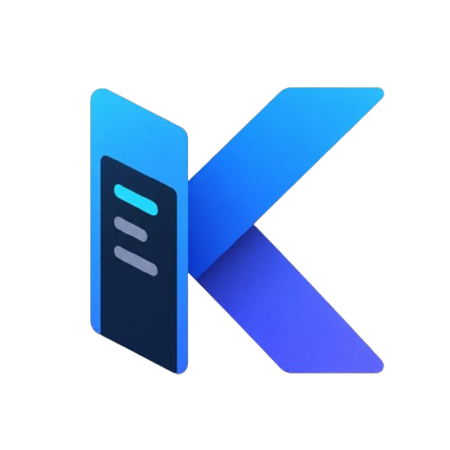
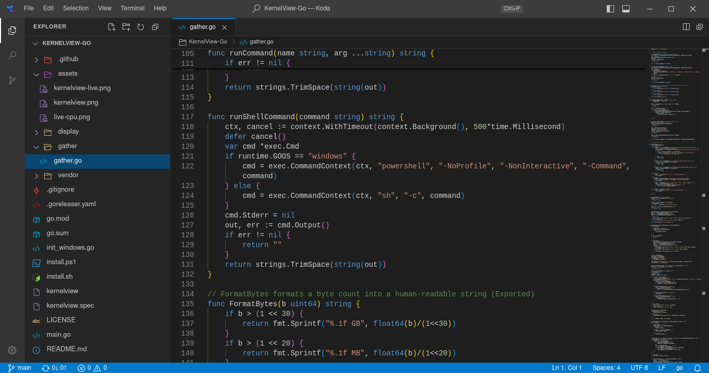
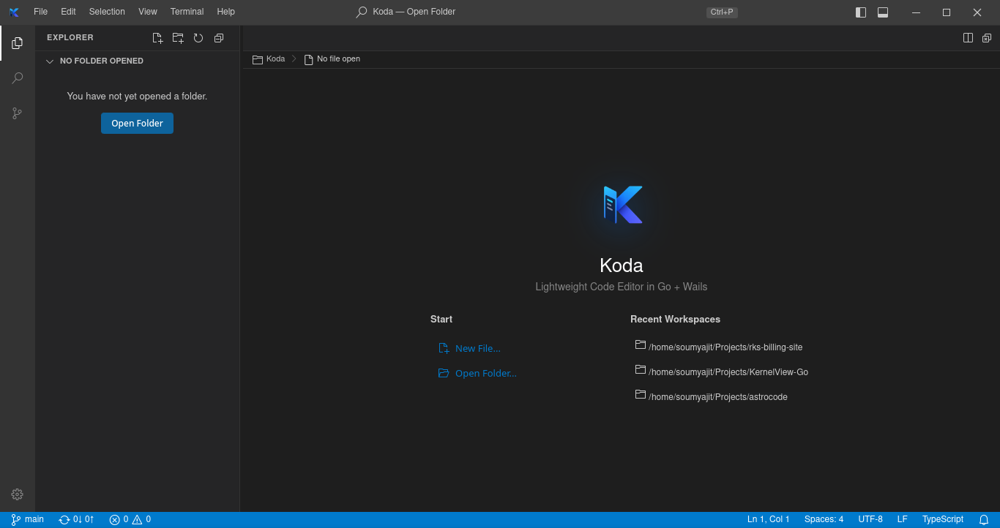
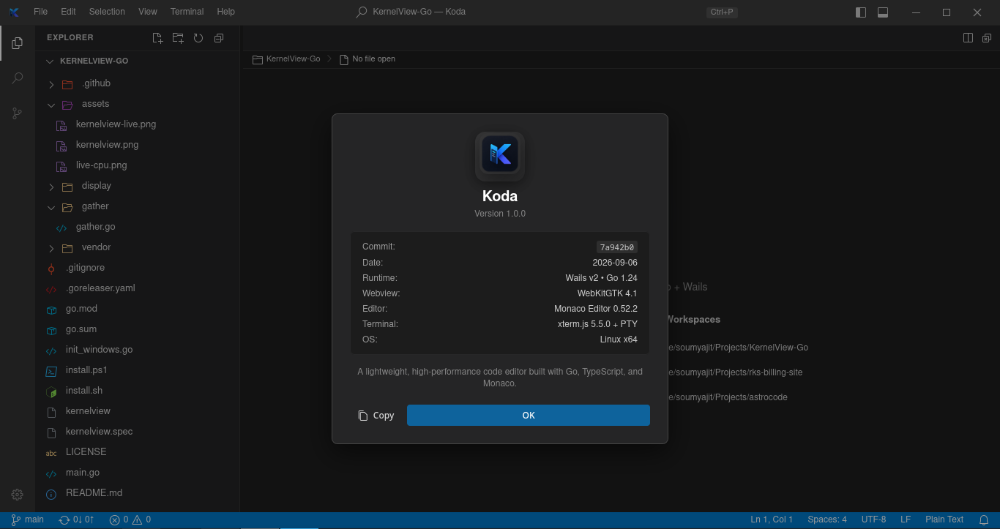

<p align="center">
  
</p>

<h1 align="center">Koda</h1>

<p align="center">
  <strong>A lightweight, ultra-fast desktop code editor built with Go, Wails v2, and Monaco.</strong>
</p>

<p align="center">
  
  
  
  
  
</p>

---

## 📸 Screenshots

### Code Editor & Workspace Explorer


### Welcome & Start Screen


### Native VS Code Style About Modal


---

## ⚡ Why Koda?

Most modern code editors rely on Electron, which bundles an entire Chromium browser and Node.js runtime, often resulting in heavy RAM usage (500MB–1GB+ idle) and noticeable startup latency.

**Koda** provides the exact visual feel, workflow, and developer ergonomics of Visual Studio Code—including the Monaco code editor, file tree, Git staging, global search, and integrated PTY terminal—while being engineered in **Go** using **Wails v2** and native system webviews.

- 🚀 **Near-Instant Cold Start**: Launches in under 1 second with a smooth zero-flash startup animation.
- 💾 **Minimal Memory Footprint**: Runs typically under 150MB of RAM idle.
- 📦 **Single Static Executable**: Go compiles all backend services and bundled frontend assets into a single standalone binary.
- 🔒 **Zero Telemetry**: Completely private, offline-first, and telemetry-free.

---

## ✨ Features

- **Monaco-Powered Code Editor**: Embedded Monaco engine offering rich syntax highlighting, IntelliSense, multi-cursor editing, bracket pair colorization, minimap, code folding, and side-by-side diff editing.
- **Integrated Real PTY Terminal**: Full interactive terminal sessions (`bash`, `zsh`, `sh`) managed via `github.com/creack/pty` and streamed over Wails events to `xterm.js`.
- **Live File Explorer**: Full directory tree navigation with file and folder icons, file/folder creation, renaming, deletion, reveal in system file manager, and real-time filesystem updates powered by `fsnotify`.
- **Git Integration (Source Control)**: Branch indicator, sync status (ahead/behind), status badges (`M`, `A`, `U`, `D`), staging/unstaging, side-by-side Monaco diff viewer, and commit shortcut (`Ctrl+Enter`).
- **Global Search & Replace**: High-speed concurrent Go search across workspace files with Regex, Case Sensitive, Whole Word, and Include/Exclude glob filtering.
- **Command Palette & Quick Open**:
  - `Ctrl+P`: Quick Open fuzzy file switcher.
  - `Ctrl+Shift+P`: Command Palette with search across all IDE actions.
- **Native Settings & Theming**:
  - Pixel-accurate VS Code Dark+ and Light+ themes.
  - Visual settings editor without web-like styling cards; renders clean native VS Code controls.
  - Window Mode switch (Auto / Wayland / X11).
- **Wayland & X11 Windowing**:
  - Auto-detection and manual toggle for display servers.
  - Uses Wayland's native compositor titlebar on Wayland, and custom VS Code window chrome on X11 / XWayland.
- **Native Desktop Polish**: Anti-flash splash screen, lazy loading of diff editor components, overlay scrollbars, and guards against web text selection or unwanted browser context menus.

---

## ⚠️ Status & Installation

> [!WARNING]
> **Koda is currently under active development and is not completely ready for daily use.**
> Features and APIs are evolving rapidly. If you would like to try or experiment with Koda, please build from source using the instructions below.

> [!TIP]
> **Linux Display Server Recommendation**:
> We strongly recommend using **X11** on Linux for optimal native window decoration, titlebar behavior, and runtime stability. If you are on Wayland, you can switch the Window Mode in **Settings (`Ctrl+,`) &rarr; Window Mode &rarr; X11** or run under your compositor's XWayland backend.

---

## 🛠️ Building from Source

### Prerequisites

Make sure you have the following installed on your system:

1. **Go**: Version 1.22 or newer ([golang.org](https://golang.org/dl/))
2. **Node.js & npm**: Node 18+ ([nodejs.org](https://nodejs.org/))
3. **C Compiler & WebKitGTK / GTK3 libraries** (on Linux):
   - **Debian / Ubuntu / Pop!_OS / Linux Mint**:
     ```bash
     sudo apt update
     sudo apt install -y build-essential pkg-config libgtk-3-dev libwebkit2gtk-4.1-dev
     ```
   - **Fedora / RHEL**:
     ```bash
     sudo dnf install -y gcc-c++ pkgconf-pkg-config gtk3-devel webkit2gtk4.1-devel
     ```
   - **Arch Linux / Manjaro**:
     ```bash
     sudo pacman -S --needed base-devel gtk3 webkit2gtk-4.1
     ```

### Build Steps

1. **Clone the repository**:
   ```bash
   git clone https://github.com/codedbysoumyajit/Koda.git
   cd astrocode
   ```

2. **Build frontend & native binary using Make**:
   ```bash
   make build
   ```
   *(This installs npm dependencies, bundles Vite/Monaco frontend assets, and compiles the Go binary into `build/bin/koda`.)*

3. **Run Koda**:
   ```bash
   ./build/bin/koda
   ```

#### Manual Build Steps (without Make)

```bash
# 1. Build frontend
cd frontend
npm install
npm run build
cd ..

# 2. Compile Go binary
mkdir -p build/bin
go build -tags "desktop,production,webkit2_41" -o build/bin/koda .

# 3. Launch
./build/bin/koda
```

---

## 🏗️ Architecture

```
astrocode/
├── main.go                      # Wails entrypoint & window configuration
├── app.go                       # Core App lifecycle & service registration
├── wails.json                   # Wails project config
├── internal/
│   ├── editorsvc/               # File I/O, directory tree traversal, fsnotify live watch
│   ├── termsvc/                 # PTY session management & real-time output stream
│   ├── gitsvc/                  # Git operations (status, diff, stage, commit, branch, push)
│   ├── searchsvc/               # Fast concurrent workspace search & replace
│   └── settingssvc/             # Configuration loader (~/.astrocode/settings.json, keybindings)
├── frontend/
│   ├── src/
│   │   ├── main.ts              # App bootstrap, hotkey manager, splash screen
│   │   ├── style.css            # VS Code Dark+ / Light+ design system
│   │   ├── services/api.ts      # Wails backend API bridge
│   │   └── components/          # Monaco, Terminal, Explorer, Git, Search, QuickOpen, Settings
│   ├── index.html               # Shell markup with zero-flash startup
│   └── vite.config.ts           # Bundler config with Monaco split chunks
└── docs/
    └── images/                  # Screenshots & project logo
```

---

## ⌨️ Default Keybindings

| Keybinding | Action |
|---|---|
| `Ctrl+P` | Quick Open (fuzzy file search) |
| `Ctrl+Shift+P` / `F1` | Command Palette |
| `Ctrl+S` | Save active file |
| `Ctrl+Shift+S` | Save all files |
| `Ctrl+W` | Close active tab |
| `Ctrl+N` | New Untitled File |
| `Ctrl+Tab` | Switch / cycle next tab |
| `Ctrl+Shift+Tab` | Switch / cycle previous tab |
| `Ctrl+B` | Toggle Primary Sidebar |
| `Ctrl+\`` | Toggle Integrated Terminal / Bottom Panel |
| `Ctrl+Shift+\`` | New Terminal Session |
| `Ctrl+Shift+F` | Global Find in Workspace |
| `Ctrl+Shift+G` | Source Control (Git) |
| `Ctrl+Shift+E` | File Explorer |
| `Ctrl+,` | Settings |
| `F5` / `Ctrl+R` | Refresh File Explorer |
| `Ctrl+Enter` | Commit staged changes (in Git view) |

---

## 🤝 Contributing

Contributions, bug reports, and suggestions are welcome! Since the project is in active development, feel free to open an issue or submit a pull request on GitHub.

---

## 📄 License

This project is licensed under the MIT License.
